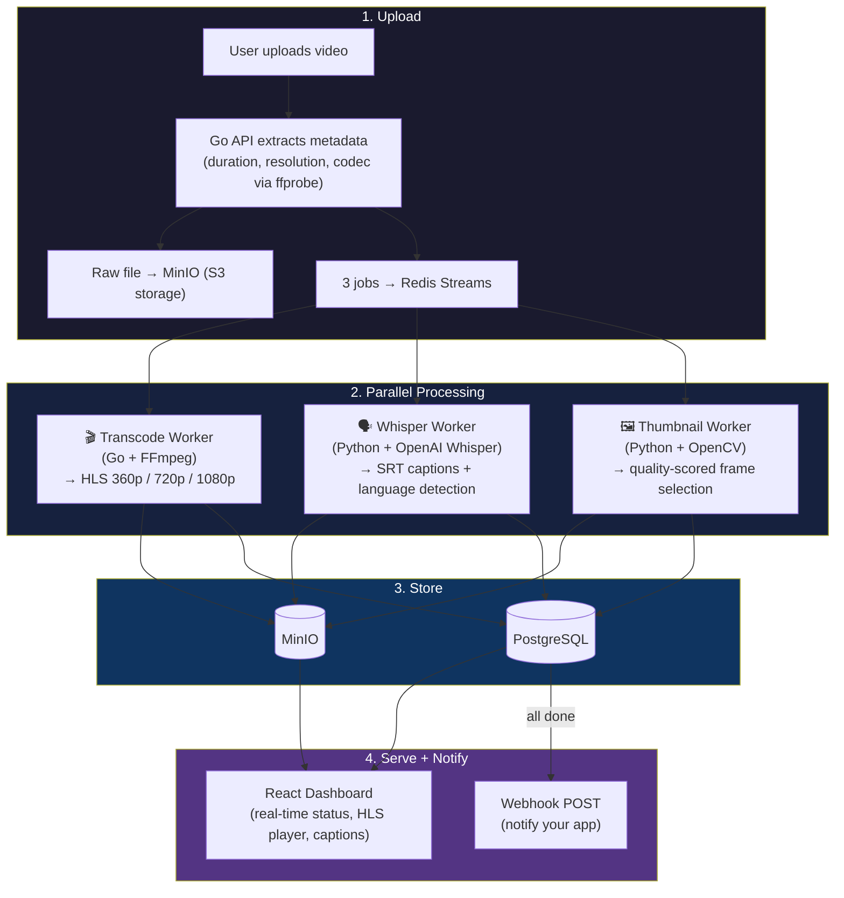
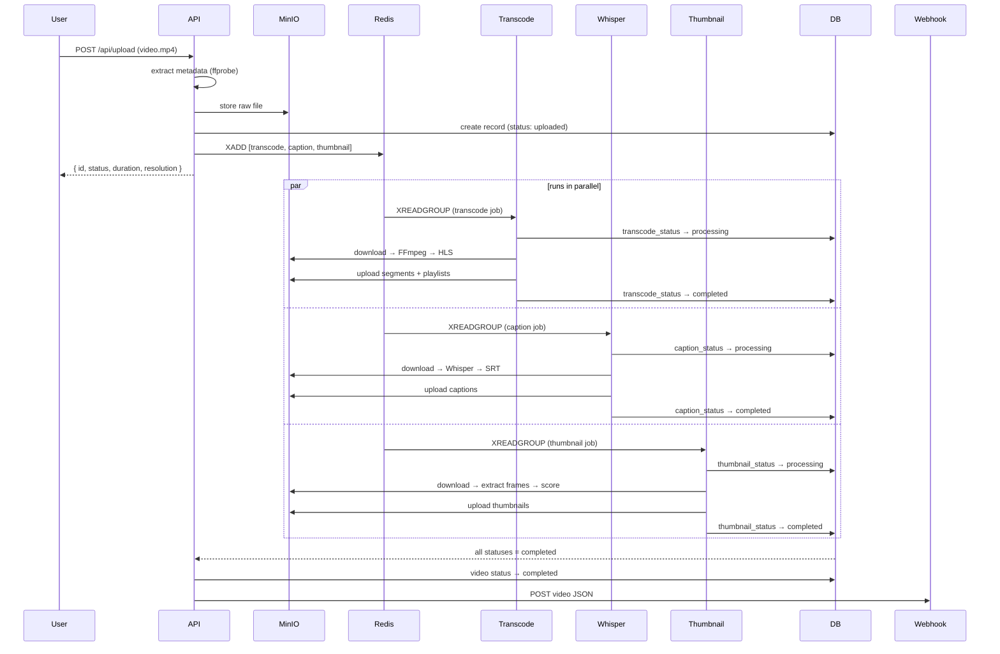

# vidpipe

the video processing backend that YouTube, Udemy, and Vimeo all had to build from scratch - except you get it with `docker compose up`.

upload a video. vidpipe transcodes it to adaptive streaming, generates captions with AI, and picks the best thumbnail. three workers, running in parallel, fully self-hosted. no API keys, no cloud bills, no vendor lock-in.

## why does this exist

every platform that handles video uploads ends up building the same pipeline:

```
raw upload → transcode → captions → thumbnails → serve
```

YouTube does this. Twitch does this. Every course platform, every internal training tool, every video-based product does this. but building it from scratch takes months - you need queue-based job distribution, S3-compatible storage, adaptive streaming, speech-to-text, frame analysis, and a dashboard to monitor it all.

vidpipe is that entire pipeline in one repo. clone it, run it, upload a video.

## the pipeline



## what each worker does

### 🎬 transcode worker (Go + FFmpeg)

takes the raw upload and produces [HLS](https://en.wikipedia.org/wiki/HTTP_Live_Streaming) adaptive streams. the video player automatically switches quality based on the viewer's connection - exactly like YouTube.

| quality | resolution | bitrate | when it's used |
|---|---|---|---|
| low | 640x360 | 800 kbps | slow wifi, mobile data |
| medium | 1280x720 | 2.5 Mbps | normal playback |
| high | 1920x1080 | 5 Mbps | good connection, fullscreen |

outputs a master `.m3u8` playlist. any HLS player (Safari, hls.js, VLC, mobile apps) handles quality switching automatically.

### 🗣️ whisper worker (Python + OpenAI Whisper)

runs [OpenAI Whisper](https://github.com/openai/whisper) locally (no API key needed - the model runs inside the container). extracts audio, transcribes it, generates SRT subtitle files with timestamps.

- handles accents, background noise, and crosstalk
- auto-detects the language (40+ languages supported)
- base model runs in ~1x real-time on CPU (60s video ≈ 60s to caption)
- output: `.srt` file with timestamped segments

this is the same model that powers most AI transcription tools - but running on your hardware, for free.

### 🖼️ thumbnail worker (Python + OpenCV)

extracts 10 frames at equal intervals and scores each one:

- **sharpness** - laplacian variance (blurry frames get penalized)
- **entropy** - histogram entropy (black frames and solid colors score near zero)
- **content quality** - penalizes too-dark and too-bright frames

picks top 5 candidates, marks the winner. no more black-frame thumbnails, no more "uploading a video and manually screenshotting at 0:42."

## quickstart

```bash
git clone https://github.com/Nixxx19/vidpipe.git
cd vidpipe
docker compose up --build
```

open http://localhost:3000 and upload a video. watch it flow through the pipeline.

### services

| service | port | what |
|---|---|---|
| dashboard | http://localhost:3000 | upload, watch, browse |
| api | http://localhost:8080 | REST API |
| minio console | http://localhost:9001 | browse stored files |
| postgres | 5432 | metadata |
| redis | 6379 | job queue |

minio credentials: `vidpipe` / `vidpipe123`

## api

```bash
# upload a video
curl -X POST http://localhost:8080/api/upload -F "file=@video.mp4"

# response:
{
  "id": "550e8400-e29b-41d4-a716-446655440000",
  "filename": "video.mp4",
  "status": "uploaded",
  "duration": 127.4,
  "width": 1920,
  "height": 1080
}

# list all videos
curl http://localhost:8080/api/videos

# get video with full metadata
curl http://localhost:8080/api/videos/{id}

# response includes:
#   transcode_status: pending → processing → completed
#   caption_status:   pending → processing → completed
#   thumbnail_status: pending → processing → completed
#   hls_path:         path to HLS master playlist
#   caption_path:     path to SRT file
#   caption_text:     full transcript
#   caption_language: detected language code
#   thumbnail_path:   best thumbnail
#   thumbnail_candidates: all scored thumbnails

# stream the video (HLS)
curl http://localhost:8080/api/videos/{id}/stream
```

### webhooks

set the `WEBHOOK_URL` environment variable in docker-compose.yml. when all three workers finish processing a video, vidpipe sends a POST request with the full video JSON to your URL.

```bash
# example: notify your app when processing completes
WEBHOOK_URL=https://your-app.com/api/video-ready
```

use this to trigger downstream actions - update your UI, send an email, index the transcript for search, whatever.

## architecture decisions

**why redis streams, not kafka** - kafka is designed for millions of events per second across a distributed cluster. we're processing video uploads. redis streams give us consumer groups, message acknowledgment, and pending message recovery - all the guarantees we need, with zero additional infrastructure.

**why minio, not the filesystem** - every production deployment uses S3-compatible storage. minio means the same code works with AWS S3, Google Cloud Storage, Cloudflare R2, or DigitalOcean Spaces. change one environment variable.

**why go + python, not all one language** - go handles the I/O-heavy parts (upload, streaming, FFmpeg process management) where goroutines shine. python handles the ML parts (whisper, opencv) where the ecosystem is 10 years ahead. each worker is a separate container - scale them independently.

**why hls, not dash** - safari plays HLS natively. everything else uses hls.js (a 50KB library). dash needs a larger player library and has worse mobile support.

**why consumer groups, not pub/sub** - each job must be processed exactly once. if a worker crashes mid-transcode, the message stays in the pending list and gets picked up by another worker. no lost jobs, no duplicate processing.

**why whisper runs locally** - no API key, no per-minute billing, no data leaving your network. the base model is 140MB and runs on CPU. for a self-hosted tool, this matters.

## how a video flows through the system



## tech stack

| layer | tech | role |
|---|---|---|
| api server | Go + Fiber | upload, video listing, HLS proxy |
| transcode | Go + FFmpeg | raw → HLS (360p/720p/1080p) |
| captions | Python + Whisper | speech-to-text, SRT generation |
| thumbnails | Python + OpenCV | frame extraction + quality scoring |
| job queue | Redis Streams | parallel job distribution, consumer groups |
| object storage | MinIO | S3-compatible, stores all files |
| database | PostgreSQL | metadata, status tracking |
| dashboard | React + Vite + Tailwind | upload UI, HLS player, status monitoring |
| deployment | Docker Compose | one command, 6 containers |

## who uses something like this

- **course platforms** - upload a lecture, get captions + streaming automatically (Udemy, Coursera all have this)
- **internal tools** - company training videos, meeting recordings with searchable transcripts
- **video-first products** - any app with user-uploaded video needs this pipeline
- **content platforms** - TikTok/YouTube-style apps need transcoding + thumbnails at scale
- **accessibility compliance** - auto-generated captions for WCAG/ADA requirements

## what makes this different from a FFmpeg script

| | typical tutorial | vidpipe |
|---|---|---|
| processing | one FFmpeg command, runs synchronously | 3 parallel workers via message queue |
| captions | none | Whisper AI, auto-detected language |
| thumbnails | first frame or manual | quality-scored frame selection |
| storage | local filesystem | S3-compatible (MinIO/AWS/GCS) |
| failure handling | crashes and you lose the file | consumer groups, message retry |
| scaling | single process | each worker scales independently |
| monitoring | none | dashboard with real-time status |
| deployment | "run this script" | `docker compose up` |

## project structure

```
vidpipe/
├── docker-compose.yml              6 services, one command
│
├── api/                            Go API server
│   ├── main.go                     routes, startup, middleware
│   ├── handlers/
│   │   ├── upload.go               multipart upload + ffprobe metadata
│   │   ├── videos.go               CRUD + webhook notifications
│   │   └── stream.go               HLS proxy from MinIO
│   ├── queue/redis.go              Redis Streams job producer
│   ├── storage/minio.go            S3 file operations
│   └── db/
│       ├── postgres.go             connection pool
│       └── models.go               Video model + queries
│
├── workers/
│   ├── transcode/                  Go + FFmpeg
│   │   ├── main.go                 HLS transcoding (3 qualities)
│   │   └── Dockerfile              alpine + ffmpeg
│   ├── whisper/                    Python + Whisper
│   │   ├── main.py                 speech-to-text + SRT
│   │   └── Dockerfile              python + ffmpeg + whisper
│   └── thumbnail/                  Python + OpenCV
│       ├── main.py                 frame scoring + selection
│       └── Dockerfile              python + opencv
│
├── dashboard/                      React + Vite + Tailwind
│   └── src/
│       ├── pages/
│       │   ├── Upload.tsx          drag-and-drop upload
│       │   ├── VideoList.tsx       grid with live status
│       │   └── VideoDetail.tsx     player + captions + thumbnails
│       └── components/
│           ├── VideoPlayer.tsx     HLS.js adaptive player
│           ├── StatusBadge.tsx     animated status indicators
│           └── UploadDropzone.tsx  file drop zone
│
└── db/init.sql                     PostgreSQL schema
```

