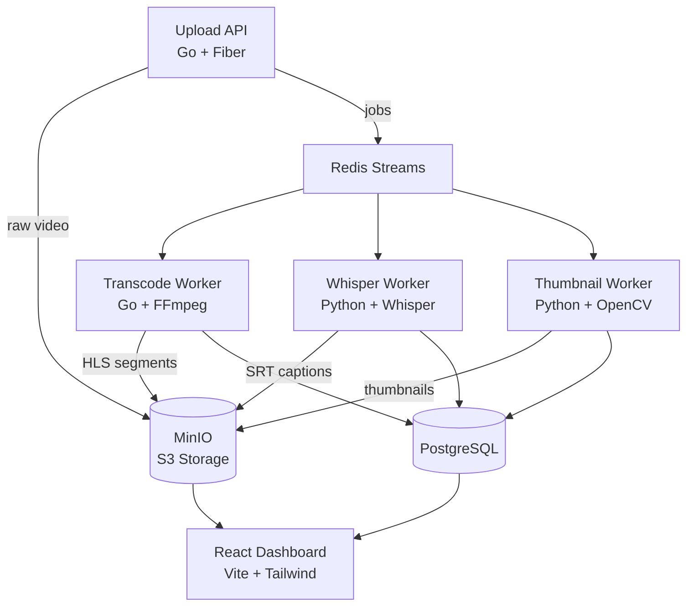

# streamforge

end-to-end video processing pipeline with AI-powered captions, smart thumbnails, and adaptive streaming.

upload a video → it gets transcoded to HLS (360p/720p/1080p), captioned with Whisper, and thumbnailed with quality-scored frame selection. all in parallel.

## architecture



## what it does

**transcode worker** — FFmpeg transcoding to 3 qualities (360p/720p/1080p) with HLS adaptive streaming. generates master playlist + segments.

**whisper worker** — extracts audio, runs OpenAI Whisper (base model) for auto-captions. outputs SRT files with timestamps. detects language automatically.

**thumbnail worker** — extracts 10 frames at equal intervals, scores each by sharpness (laplacian variance) + entropy. picks the best 5, marks the winner. no more black-frame thumbnails.

**dashboard** — upload with drag-and-drop, watch processing status update in real-time, play HLS streams with captions, browse thumbnail candidates.

## quickstart

```bash
git clone https://github.com/Nixxx19/streamforge.git
cd streamforge
docker compose up --build
```

that's it. open http://localhost:3000 and upload a video.

**services:**
| service | port | what |
|---|---|---|
| dashboard | 3000 | react UI |
| api | 8080 | upload + video API |
| minio console | 9001 | storage browser (streamforge/streamforge123) |
| postgres | 5432 | metadata |
| redis | 6379 | job queue |

## api

```bash
# upload a video
curl -X POST http://localhost:8080/api/upload \
  -F "file=@video.mp4"

# list all videos
curl http://localhost:8080/api/videos

# get video details
curl http://localhost:8080/api/videos/{id}

# stream HLS
curl http://localhost:8080/api/videos/{id}/stream
```

## tech stack

- **Go + Fiber** — API server and transcode worker
- **Python** — Whisper captions + OpenCV thumbnail extraction
- **Redis Streams** — job queue with consumer groups (not basic pub/sub)
- **PostgreSQL** — video metadata and processing status
- **MinIO** — S3-compatible object storage
- **FFmpeg** — HLS transcoding (360p/720p/1080p)
- **OpenAI Whisper** — automatic speech recognition
- **OpenCV** — frame extraction + quality scoring
- **React + Vite + Tailwind** — dashboard
- **Docker Compose** — one-command deployment

## project structure

```
streamforge/
├── docker-compose.yml          full stack orchestration
├── api/                        Go upload API + HLS streaming
│   ├── handlers/               upload, video list, HLS proxy
│   ├── queue/                  Redis Streams producer
│   ├── storage/                MinIO client
│   └── db/                     PostgreSQL models
├── workers/
│   ├── transcode/              Go + FFmpeg → HLS
│   ├── whisper/                Python + Whisper → SRT captions
│   └── thumbnail/              Python + OpenCV → scored thumbnails
├── dashboard/                  React + Vite + Tailwind
│   └── src/
│       ├── pages/              Upload, VideoList, VideoDetail
│       └── components/         VideoPlayer, StatusBadge, UploadDropzone
└── db/
    └── init.sql                schema
```

## how the pipeline works

1. user uploads a video via dashboard or API
2. raw file is stored in MinIO, metadata saved to PostgreSQL
3. three jobs are published to Redis Streams: `transcode`, `caption`, `thumbnail`
4. workers consume jobs in parallel via consumer groups
5. each worker downloads the raw video, processes it, uploads results to MinIO, updates PostgreSQL
6. dashboard polls for status updates and shows results when ready

## license

MIT
