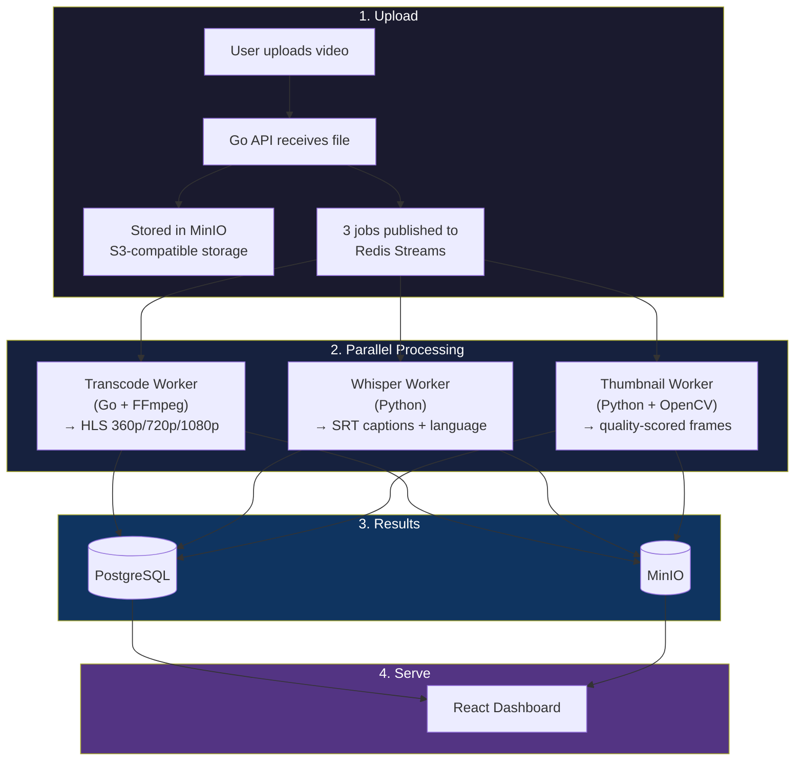
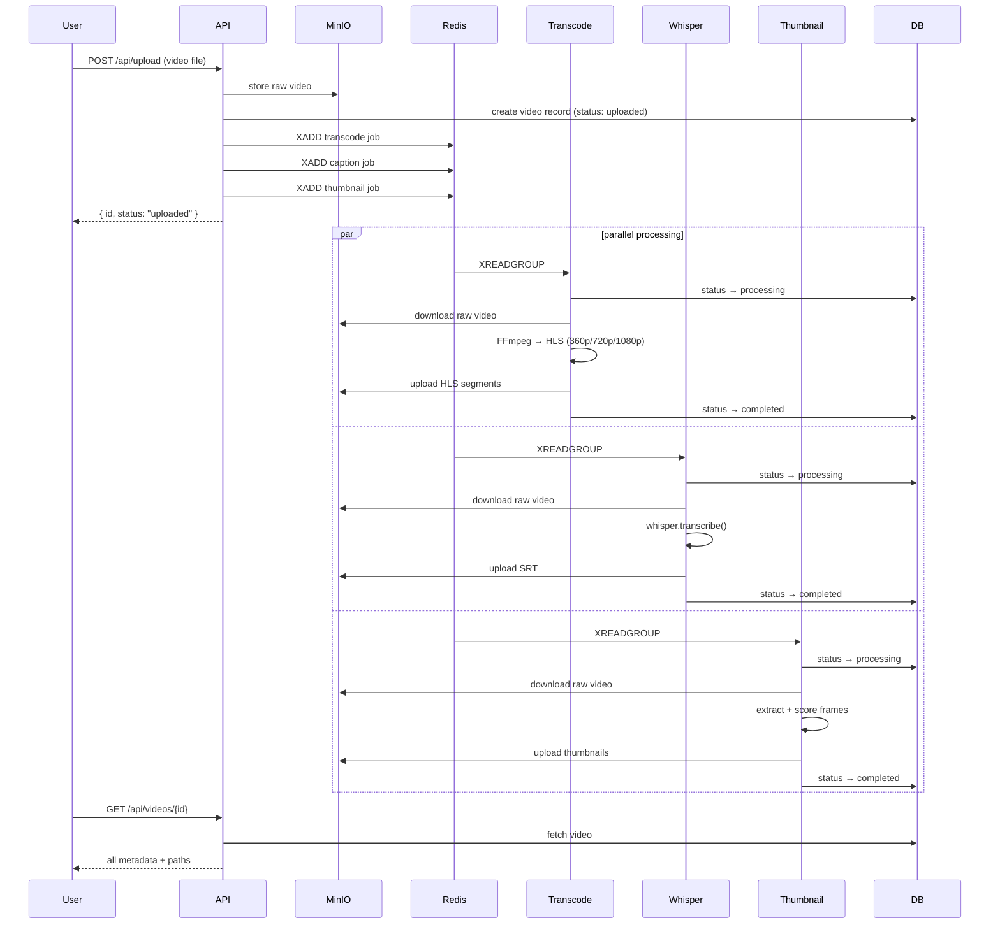

# vidpipe

a self-hosted video processing pipeline that automatically generates captions, picks the best thumbnail, and transcodes to adaptive streaming — all from a single upload.

built because most video platforms handle uploads with a single FFmpeg command and call it a day. vidpipe treats every upload as a pipeline: three independent workers process the video in parallel, each doing one thing well.

## the problem

you upload a video to your platform. now you need to:
- transcode it to multiple qualities so it plays smoothly on slow connections
- generate captions so it's accessible (and searchable)
- pick a thumbnail that isn't a black frame or someone mid-blink

most teams do this sequentially, or skip the hard parts entirely. vidpipe does all three in parallel, automatically, the moment you upload.

## how it works



## the three workers

### transcode worker (Go + FFmpeg)
takes the raw upload and produces HLS adaptive streams at three quality levels. the player automatically switches between them based on the viewer's connection speed.

| quality | resolution | bitrate | use case |
|---|---|---|---|
| low | 640x360 | 800 kbps | mobile / slow connections |
| medium | 1280x720 | 2.5 Mbps | default playback |
| high | 1920x1080 | 5 Mbps | desktop / fast connections |

outputs a master `.m3u8` playlist that references all three quality streams. any HLS-compatible player (Safari, hls.js, VLC) handles the rest.

### whisper worker (Python + OpenAI Whisper)
extracts the audio track and runs it through OpenAI's Whisper model (base) for automatic speech recognition. produces an SRT subtitle file with word-level timestamps. also detects the spoken language automatically — no config needed.

why whisper: it handles accents, background noise, and multiple languages without any training. the base model runs on CPU in ~1x real-time (a 60-second video takes ~60 seconds to caption).

### thumbnail worker (Python + OpenCV)
extracts 10 frames at equal intervals across the video. scores each frame on two metrics:

- **sharpness** — laplacian variance (blurry frames score low)
- **entropy** — histogram entropy (frames with actual content score higher than solid colors or black frames)

picks the top 5 candidates, marks the best one. no more black-frame thumbnails, no more selecting frame #1 and hoping for the best.

## quickstart

```bash
git clone https://github.com/Nixxx19/vidpipe.git
cd vidpipe
docker compose up --build
```

open http://localhost:3000, drag in a video, and watch it flow through the pipeline.

### services

| service | port | url |
|---|---|---|
| dashboard | 3000 | http://localhost:3000 |
| api | 8080 | http://localhost:8080 |
| minio console | 9001 | http://localhost:9001 |
| postgres | 5432 | — |
| redis | 6379 | — |

minio console credentials: `vidpipe` / `vidpipe123`

## api reference

```bash
# upload a video
curl -X POST http://localhost:8080/api/upload \
  -F "file=@video.mp4"

# response
# { "id": "550e8400-e29b-41d4-a716-446655440000", "status": "uploaded" }

# list all videos (newest first)
curl http://localhost:8080/api/videos

# get single video with all metadata
curl http://localhost:8080/api/videos/{id}

# response includes:
# - transcode_status: pending | processing | completed | failed
# - caption_status: pending | processing | completed | failed
# - thumbnail_status: pending | processing | completed | failed
# - hls_path: path to master playlist
# - caption_path: path to SRT file
# - caption_text: full transcript text
# - caption_language: detected language (en, es, fr, etc.)
# - thumbnail_path: best thumbnail
# - thumbnail_candidates: all 5 scored thumbnails

# stream HLS video
curl http://localhost:8080/api/videos/{id}/stream
```

## architecture decisions

**redis streams over kafka** — kafka is overkill for this scale. redis streams give us consumer groups, message acknowledgment, and pending message recovery with zero additional infrastructure. the same redis instance handles caching too.

**minio over local filesystem** — every production deployment uses S3-compatible storage. using MinIO means the code works identically with AWS S3, Google Cloud Storage, or DigitalOcean Spaces. just change the endpoint.

**go for api + transcode, python for ml workers** — go handles the I/O-heavy parts (upload, streaming, FFmpeg orchestration) where concurrency matters. python handles the ML parts (whisper, opencv) where the ecosystem is better. each worker is a separate container that scales independently.

**hls over dash** — better browser support (Safari native, everything else via hls.js), simpler tooling, same adaptive quality switching.

**consumer groups, not pub/sub** — each job is processed by exactly one worker. if a worker crashes mid-job, the message stays in the pending list and gets reassigned. no lost jobs.

## project structure

```
vidpipe/
├── docker-compose.yml              6 services, one command
│
├── api/                            Go upload API + HLS streaming
│   ├── main.go                     fiber app, routes, startup
│   ├── handlers/
│   │   ├── upload.go               multipart upload → MinIO + Redis jobs
│   │   ├── videos.go               list + get video metadata
│   │   └── stream.go               HLS proxy from MinIO
│   ├── queue/redis.go              Redis Streams XADD producer
│   ├── storage/minio.go            S3-compatible file operations
│   ├── db/
│   │   ├── postgres.go             connection pool
│   │   └── models.go               Video model + CRUD
│   └── Dockerfile
│
├── workers/
│   ├── transcode/                  Go + FFmpeg → HLS
│   │   ├── main.go                 consumer group loop, FFmpeg exec
│   │   └── Dockerfile              alpine + ffmpeg
│   ├── whisper/                    Python + Whisper → SRT
│   │   ├── main.py                 consumer group, whisper transcribe
│   │   └── Dockerfile              python + ffmpeg
│   └── thumbnail/                  Python + OpenCV → scored frames
│       ├── main.py                 frame extraction + quality scoring
│       └── Dockerfile              python + opencv
│
├── dashboard/                      React + Vite + Tailwind
│   └── src/
│       ├── pages/
│       │   ├── Upload.tsx          drag-and-drop + progress bar
│       │   ├── VideoList.tsx       grid with status badges
│       │   └── VideoDetail.tsx     HLS player + captions + thumbnails
│       └── components/
│           ├── VideoPlayer.tsx     hls.js wrapper
│           ├── StatusBadge.tsx     colored status indicators
│           └── UploadDropzone.tsx  drag-and-drop zone
│
└── db/init.sql                     PostgreSQL schema
```

## pipeline flow (step by step)



## tech stack

| layer | tech | why |
|---|---|---|
| api | Go + Fiber | fast, compiled, great concurrency |
| transcode | Go + FFmpeg | shell out to FFmpeg, handle file I/O |
| captions | Python + Whisper | best open-source ASR model |
| thumbnails | Python + OpenCV | frame extraction + image analysis |
| queue | Redis Streams | consumer groups, message persistence |
| storage | MinIO | S3-compatible, swappable with AWS S3 |
| database | PostgreSQL | reliable, supports arrays for thumbnail candidates |
| dashboard | React + Vite + Tailwind | fast builds, utility CSS |
| deployment | Docker Compose | single command, reproducible |

## who is this for

- **indie devs building a video platform** — drop this in as your processing backend
- **teams that need internal video tooling** — upload training videos, meeting recordings, tutorials
- **anyone replacing a manual workflow** — if you're currently running FFmpeg by hand, this automates it
- **learning distributed systems** — a real-world example of queue-based microservices with parallel workers

## what makes this different from a basic FFmpeg wrapper

most video processing repos are a single script: `ffmpeg -i input.mp4 output.m3u8`. vidpipe is a **distributed system**:

- upload and processing are decoupled (queue-based)
- three workers run in parallel, not sequentially
- each worker is a separate container that scales independently
- S3-compatible storage (not local filesystem)
- consumer groups ensure no job is lost, even if a worker crashes
- real-time status tracking through the dashboard
- AI-powered captions and smart thumbnail selection

## contributing

```bash
git clone https://github.com/Nixxx19/vidpipe.git
cd vidpipe
docker compose up --build
```

the API is at :8080, dashboard at :3000. make changes, rebuild the relevant container.

## license

MIT
